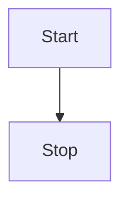
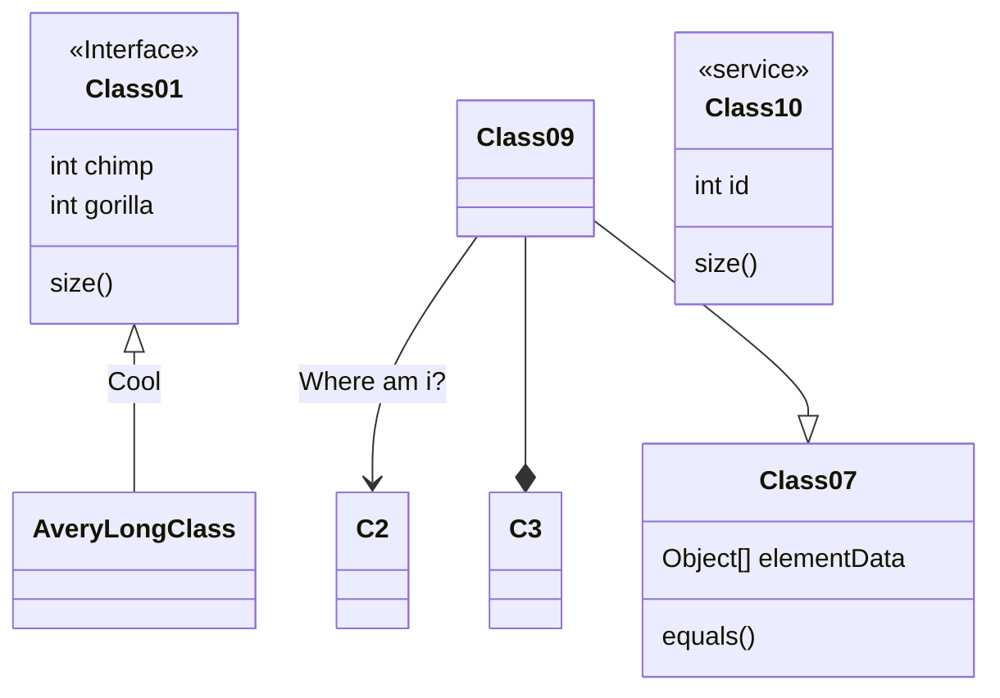

# [NOMBRE DEL PROYECTO]
### Nombre y carné de los integrantes: 

### Estado del proyecto:
### Enlace del video:
Recordar que el video debe ser público para ser visto por el profesor
Bases-de-Datos-2/Plantilla-de-proyectos

<a href="https://bases-de-datos-2.github.io/Plantilla-de-proyectos/edit-diagram.html?repo=Bases-de-Datos-2%2FPlantilla-de-proyectos&path=Ejercicios%20varios-Page-4.drawio.png" target="_blank">Edit</a> | 
<a href="https://app.diagrams.net/#G1N3xc5c4VGT1xPjbplvTEnxJIpkSSst2i" target="_blank">Edit As New</a> | 
<a href="https://app.diagrams.net/#Hjgraph%2Fdrawio-github%2Fmaster%2Fdiagram.png" target="_blank">Edit in diagrams.net</a>

<a href="http://jgraph.github.io/drawio-github/edit-diagram.html" target="_blank">edit-diagram.html</a> does the I/O with GitHub and uses diagrams.net in embed mode for diagram editing. The page supports the following URL parameters: user, pass, repo, path, ref and action=open (the Edit link above is an example). Using action=open, links for immediate diagram editing in GitHub can be created (requires user and pass parameters). You can also use files on GitHub as templates in diagrams.net via the url parameter (see Edit As New above).

Supported file formats: .png, .svg, .html and .xml (default)

    
